# LIRI Bot

 * LIRI will be a command line node app which will search Spotify for songs, Bands in Town for concerts, and OMDB for movies.
 
 ### Initial setup
 
 * Clone the files to your system


 *  To search for in Spotify, firstcreate a file named `.env`, add the following to it, replacing the values with your API keys (no quotes) once you have them:

```js
# Spotify API keys

SPOTIFY_ID=your-spotify-id
SPOTIFY_SECRET=your-spotify-secret

```

* Go to your terminal and enter below commands to install all the dependent packages
```
* npm install axios
* npm install dotenv
* npm install moment
* npm install node-spotify-api
```

### Commands and results

1. 'node liri.js concert-this <artist/band name here> [count-<value>]'
    
    * Example - node liri.js concert-this backstreet boys

    * Once the command is entered, based on the artist or band name, LiriApp will search the "Bands in town" API and provide below details results  

     * Results Screenshots : 
    ```
     * Name of the venue

     * Venue location

     * Date of the Event (use moment to format this as "MM/DD/YYYY")

     * Time of the Event 
    ```
    * Result Screenshots : 
    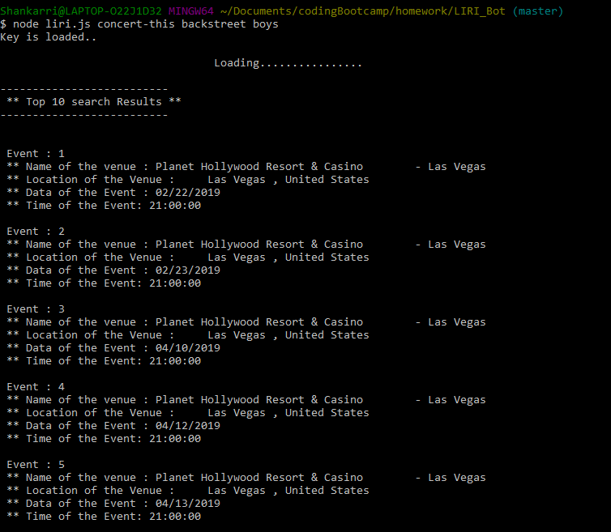
    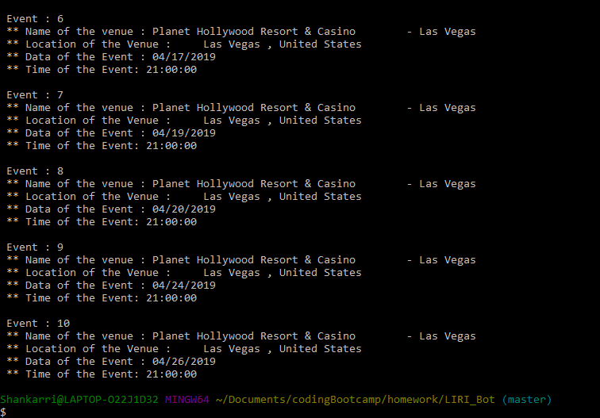
    
    * By Default, limit of the search is set to 10. So only 10 items are listed here.

    * You can also enter an optional count value at the end of the command line like

    * Example - node liri.js concert-this backstreet boys count-3

    * 'count-3' will limit the results display to 3 in the terminal, Since this is optional you don't have to enter this.
    * Result Screenshots : 
    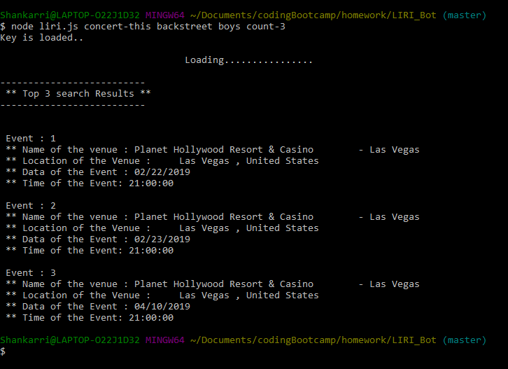

    * Example - node liri.js concert-this backstreet boys count-8
    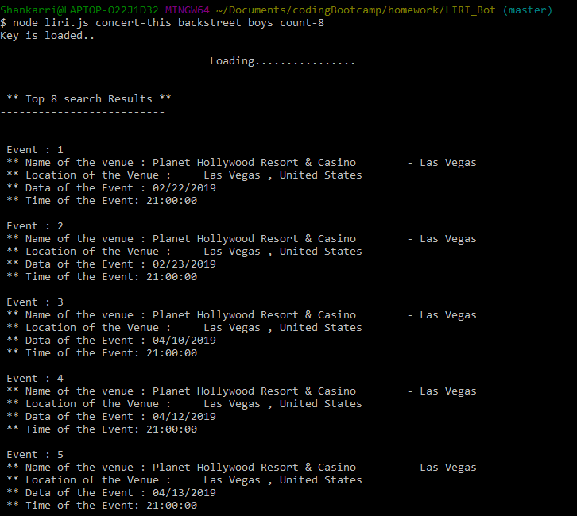
    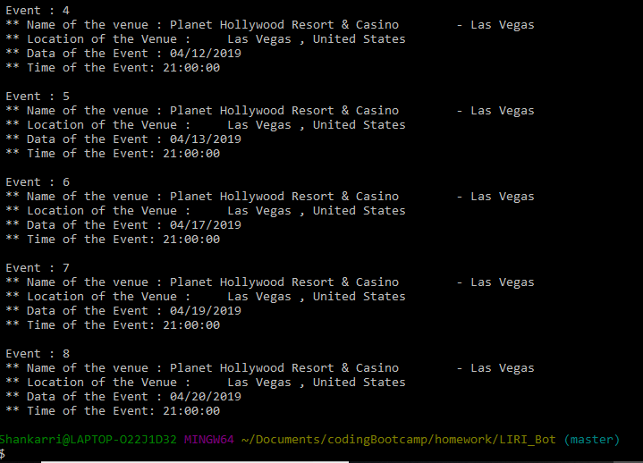


    * If the count, is not mentioned then By default first 10 results are shown.

# Error Message

    * If the band name or artist name does not return any values, then terminal will show an error message.
    
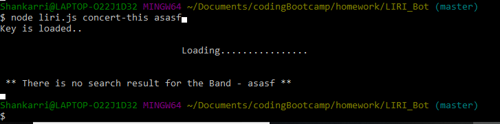


2. 'node liri.js movie-this <movie name here>'

   * Example - node liri.js movie-this harry potter

    * Once the command is entered, based on the movie, LiriApp will search the "OMDB" API and provide below details results  

     ```
    * Title of the movie.
    * Year the movie came out.
    * IMDB Rating of the movie.
    * Rotten Tomatoes Rating of the movie.
    * Country where the movie was produced.
    * Language of the movie.
    * Plot of the movie.
    * Actors in the movie.
     ```

    * Result Screenshots : 
    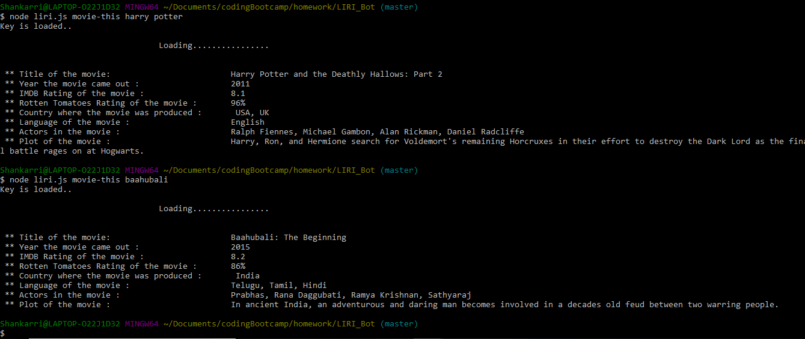
   
    * If the user doesn't type a movie in, the program will output data for the movie 'Mr. Nobody.'

    ```
     - If you haven't watched "Mr. Nobody," then you should: <http://www.imdb.com/title/tt0485947/>

     - It's on Netflix!
    ```
    * Result Screenshots : 
    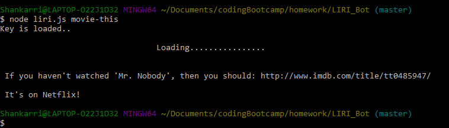

# Error Message

    * If the movie name does not return any values, then terminal will show an error message.
    
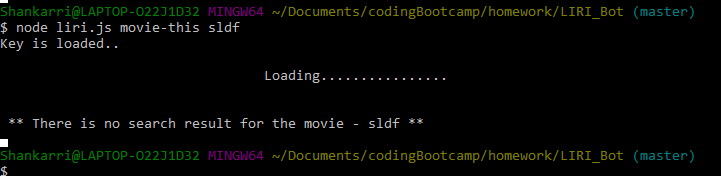

3. 'node liri.js spotify-this-song <song name here> [count-<value>]'
    
    * Example - node liri.js spotify-this-song show me the meaning

    * Once the command is entered, based on the track name, LiriApp will search the "Spotify" API and provide below details results  

    ```

     * Artist(s)

     * The song's name

     * A preview link of the song from Spotify

     * The album that the song is from
    
    ```

    * Result Screenshots : 
     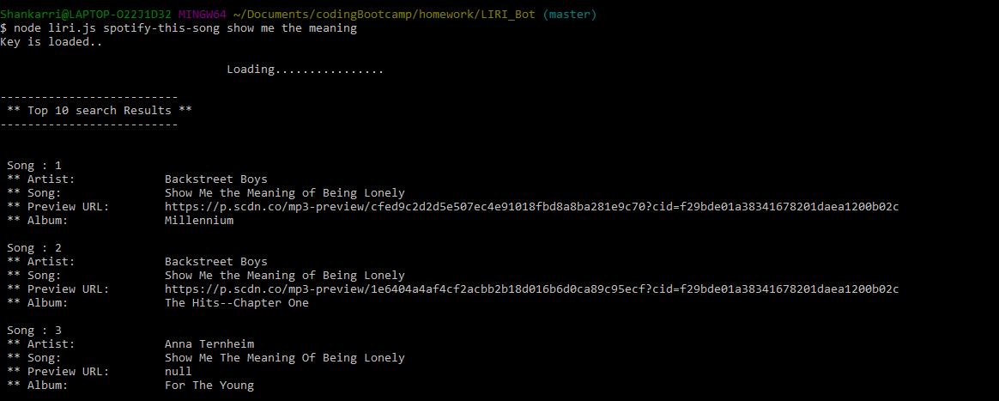
     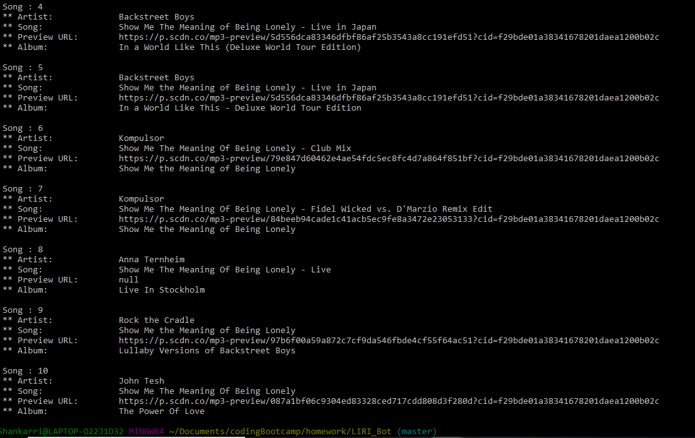
    
    * By Default, limit of the search is set to 10. So only 10 items are listed here.

    * You can also enter an optional count value at the end of the command line like
    * Example - node liri.js spotify-this-song show me the meaning count-4

    * 'count-4' will limit the results display to 4 in the terminal, Since this is optional you don't have to enter this.

     * Result Screenshots : 
     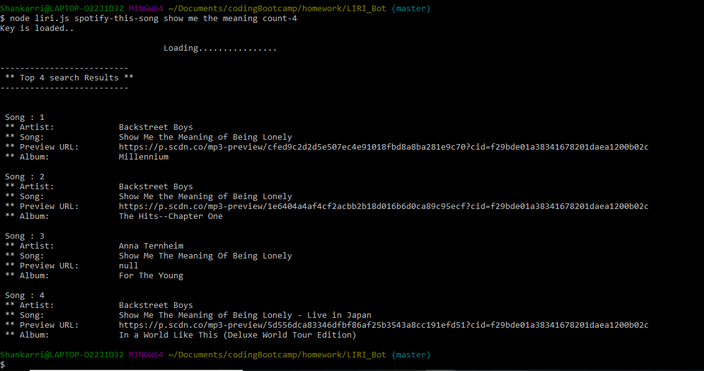

    * Example - node liri.js concert-this backstreet boys count-12
    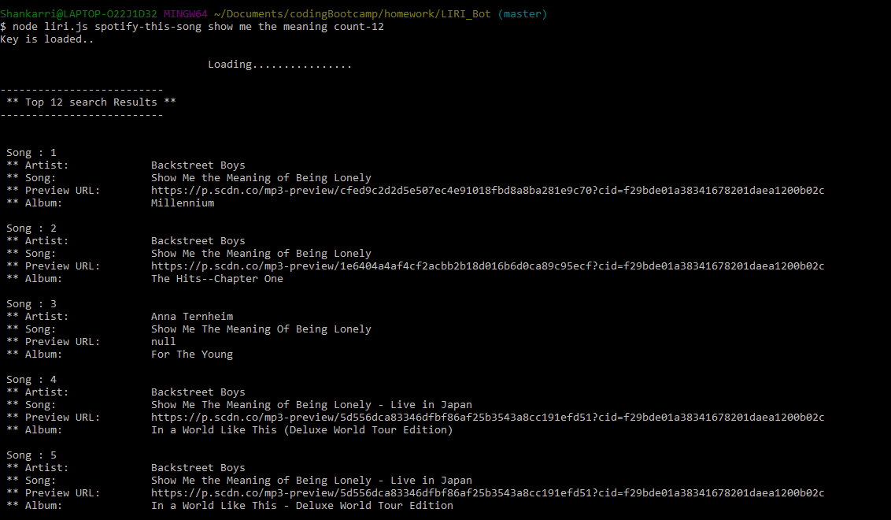
    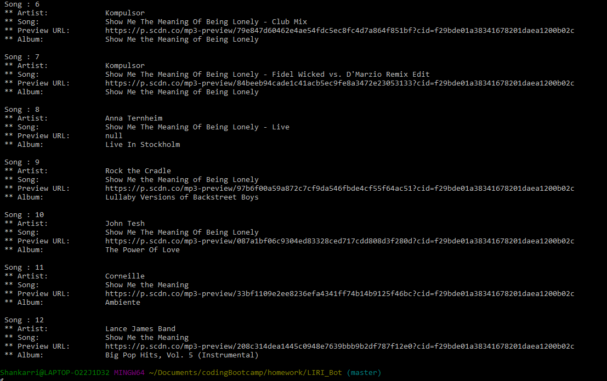


    * If the count, is not mentioned then By default first 10 results are shown.

# Error Message

    * If the song name does not return any values, then terminal will show an error message.
    
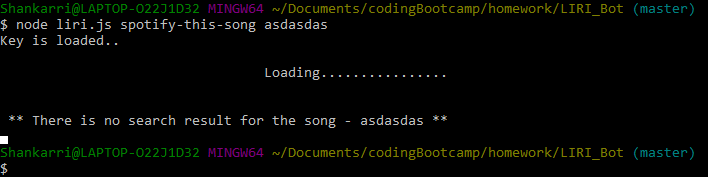


4. 'node liri.js do-what-it-says'

    * Selects a random line from random.txt and start executing the commands in the random line and disply the results in terminal

    ```
    # Random Comments present in random.txt

    * spotify-this-song,"I Want it That Way"
    * movie-this,"Harry Potter"
    * concert-this,"backstreet boys"

    ```

    * Result Screenshots : 
     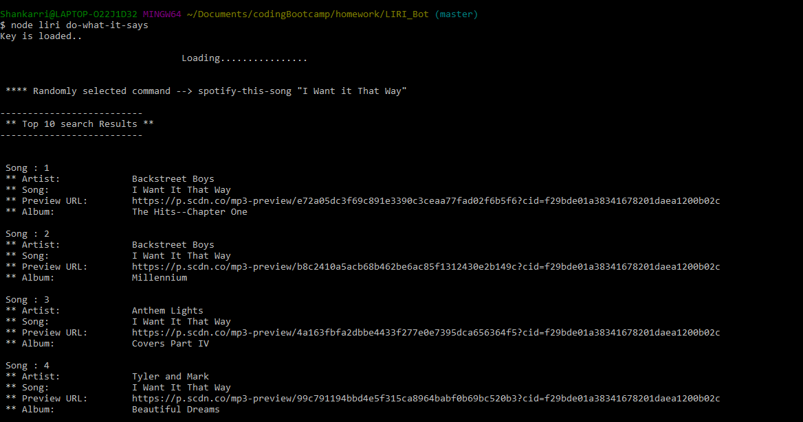
     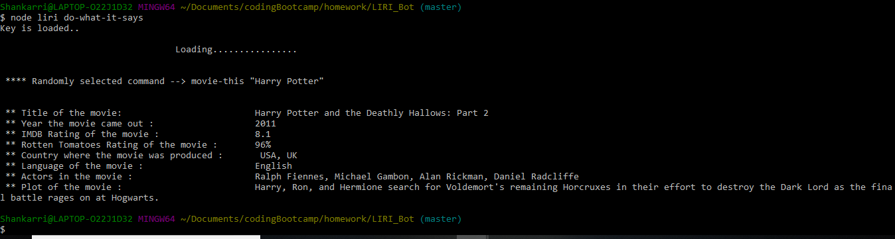
     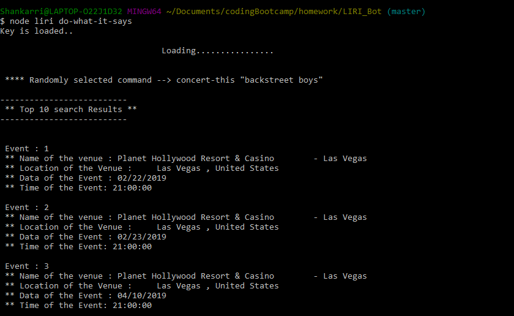

     * you can add in more custom commands in the given format and can execute them randomly .


5. Error Message 

    * If you did not enter any parameters after 'node liri' then you should get an error message 

    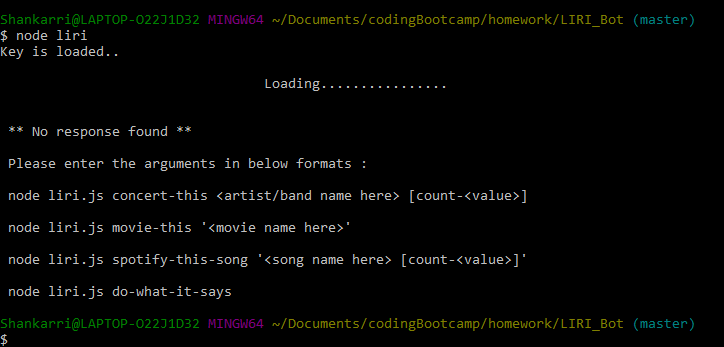

    * If you enter commands that is not mentionedthen you should get an error message 
    
    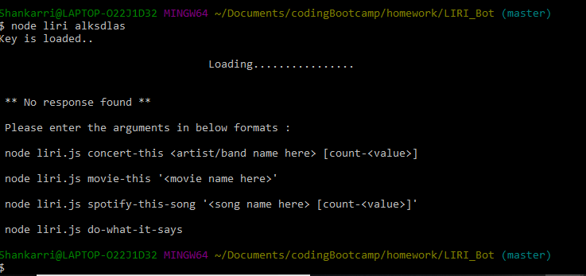
